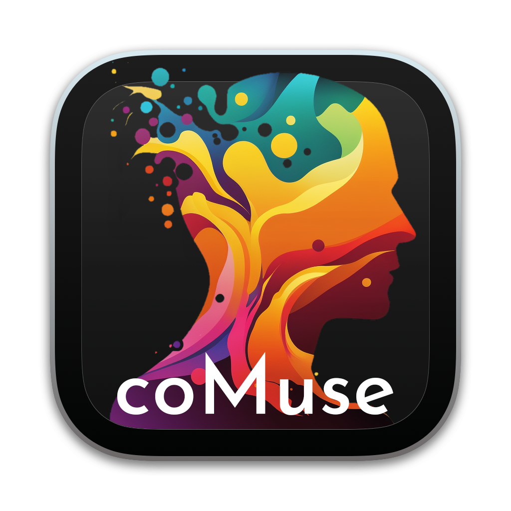

# `Collective Musical Sensehacking`

**An open-source toolset for collaborative musical experience in augmented reality.**

<!-- 

 -->

 

<!-- ## Citation
Bilbow, S. (2021). The area~ System: Exploring Real and Virtual Environments Through Gestural Ambisonics and Audio Augmented Reality. Sonic Scope: New Approaches to Audiovisual Culture. https://doi.org/10.21428/66f840a4.b74711a8

or [with BibTeX](citation.bib) -->
